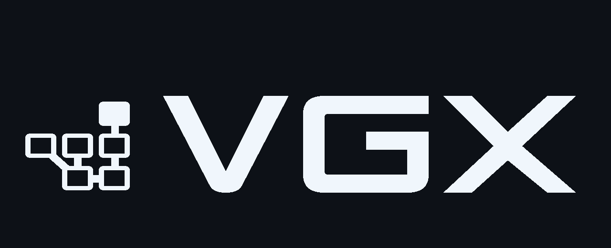

# 

[](https://badge.fury.io/py/pyvgx)
[](https://opensource.org/licenses/Apache-2.0)

High-Performance Hybrid Graph and Vector Engine with Advanced ANN Navigation

## Why VGX?

**VGX + 1 is WHY**  
**+1 is you**

Originally short for **Vector Graph indeX**, VGX is a high-performance, distributed engine for building custom search and recommendation services using Python plugins. It combines real-time graph traversal, vector similarity, and expressive filtering into a unified platform, backed by a native C-core for speed and scalability. Developers can implement service logic using the **PyVGX** C-extensions, expose it as HTTP endpoints, and automatically scale across a sharded, replicated back-end. With built-in support for ANN search (see below), dynamic graphs, expression-based filtering, and pluggable infrastructure, VGX makes it easy to develop powerful, low-latency systems for semantic search, recommendation, autocomplete, and more.

## Highlight: Approximate Nearest Neighbor (ANN) Vector Search

The **Neighborhood Navigation Query** is the most powerful feature in VGX. It turns a proximity graph into a high-performance, hybrid vector + graph search engine.

Instead of brute-force scanning or maintaining a separate vector index, you build a **navigable proximity graph** once, then use intelligent, signal-driven traversal to find the most similar items, with excellent recall and very high speed.

```python
graph.Neighborhood(
    id=entry_node,                # or synthetic hub
    hits=20,
    navigation={
        'vector': query_vector,   # probe vector
        'bias': -30               # -100 = fastest, +100 = highest recall
    }
)
```

### Key Strengths

- Single _bias_ parameter elegantly controls the entire recall/speed tradeoff
- Dynamic beam + inertia-based threshold for adaptive exploration
- Seamless hybrid queries (vector similarity + graph topology + custom filters)
- Synthetic entry points for fast global coverage
- Production-ready with unlimited sharding and replication support

This feature combines most of VGX’s internal capabilities (graph traversal, vector math, memory management, evaluator engine, adaptive algorithms) into one clear, high-value use case: low-latency semantic search, GraphRAG, recommendations, and entity resolution.

[Navigation Query Documentation](https://slysne.github.io/vgxserver/pyvgx/graph/graphNavigationQuery.html)

### ANN Performance

These numbers represent single-threaded query performance as measured on Apple M4 Max, using 1.4 million 128-D vectors, Cosine similarity:

| Bias | Recall@10 | QPS (1 thread) | Description      |
|:----:|:----------|---------------:|------------------|
| -100 | 0.008     | 42800          | Maximum speed    |
| -99  | 0.246     | 21936          |                  |
| -90  | 0.657     | 10892          | Fast             |
| -75  | 0.801     | 6657           |                  |
| -60  | 0.8799    | 4828           | Balanced         |
| -25  | 0.989     | 1232           |                  |
| 0    | 0.994     | 881            | High recall      |
| 25   | 0.997     | 719            | Very high recall |
| 75   | 0.9996    | 268            | Near-exhaustive  |
| 100  | 0.9999    | 71             | Maximum recall   |

The single _bias_ parameter gives you smooth, predictable control over the entire recall/speed spectrum.

# 

Parallel workloads scale almost linearly:

# 

## About This Project

VGX was originally developed in-house at Rakuten, Inc. between 2014 and 2025 as a versatile platform for live services. Built from the ground up, it focuses on maximizing memory efficiency and hardware utilization while delivering consistent low-latency performance. In 2025, we open-sourced the platform to share its capabilities with the wider community and foster collaboration.

## Getting Started

You will need Python 3.9 or higher and one of the supported operating systems:

- **macOS**: 14 (Sonoma) or higher
- **Linux**: glibc 2.34 or higher (e.g. Ubuntu 22.04+)
- **Windows**: 10 or higher

It is usually a good idea to use a virtual environment to keep things isolated:

**MacOS / Linux venv setup**
```bash
python3 -m venv vgxenv
source vgxenv/bin/activate
```

**Windows venv setup**
```bat
python -m venv vgxenv
call vgxenv\Scripts\activate.bat
```

**Install PyVGX**
```bash
pip install pyvgx
```

## Hello VGX

Now let's define and expose a service using VGX:

**Plugin Code**
```python
# hello.py
from pyvgx import *

system.Initialize("hello")

# This function will be exposed as an HTTP endpoint
def Hello(request: PluginRequest, message: str = "nothing"):
    response = PluginResponse()
    response.Append(f"Hi, you said {message}")
    return response

system.AddPlugin(Hello)

system.StartHTTP(9000) # main port=9000, admin port=9001
print("Visit 'http://127.0.0.1:9001' for admin" )

# Until SIGINT
system.RunServer()
```

**Start Service**
```bash
# Run the service
python hello.py
```

**Send Request**
```bash
# Send a request
curl http://127.0.0.1:9000/vgx/plugin/Hello?message=hello!
```

## Simple Graph Examples

### Example 1: Build relationships and ask a question

```python
from pyvgx import *

# Make some friends
g = Graph( "friends" )
g.Connect( "Alice", "knows", "Bob" )
g.Connect( "Alice", "knows", "Charlie" )
g.Connect( "Alice", "knows", "Diane" )
g.Connect( "Charlie", "likes", "coffee" )

# Which of Alice's friends likes coffee?
g.Neighborhood(
    "Alice",
    arc      = "knows",
    neighbor = {
        'arc'      : "likes",
        'neighbor' : "coffee"
    }
) # -> ['Charlie']
```

### Example 2: Build a simple vector graph and find most similar match

```python
from pyvgx import *
import random

# Connect root to many vertices with vectors
root = g.NewVertex( "root" )
for n in range( 10000 ):
    v = g.NewVertex( f"v{n}" )
    v.SetVector( g.sim.rvec(1024) ) # assign a random vector
    r = g.Connect( root, "to", v )

# Select a target and derive a probe (add noise) from its vector
target = g["v7357"]
probe = [x + 0.5 * (random.random()-0.5) for x in target.GetVector().external]

# Run a query around root and sort by similarity to probe vector
g.Neighborhood(
    id="root",
    hits=3,
    fields=F_ID|F_RANK,
    vector=probe,
    sortby=S_RANK,
    rank="cosine(vector, next.vector)"
) # -> ['{"id": "v7357", "rankscore": 0.97...}', ...]
```

**Note**: For production-grade vector search, use the full `navigation={...}` API instead. See [Navigation Query Documentation](https://slysne.github.io/vgxserver/pyvgx/graph/graphNavigationQuery.html) for much better control and performance.

## VGX Demo System

If you want to see a larger demo system in action, type the following in a terminal:

```bash
# Start a multi-node VGX system
vgxdemosystem multi
```

This will start many server instances (using ~16GB RAM) and open a system dashboard in your web browser:

# 

Allow startup to finish and then try to send a query to the dispatcher running on port 9990:

```bash
# Run test queries, return JSON search result
curl -s http://127.0.0.1:9990/vgx/plugin/search?name=7357 | jq
curl -s http://127.0.0.1:9990/vgx/plugin/search?name=index | jq
```

You can see how the demo is implemented here: [vgxdemoservice.py](https://github.com/slysne/vgxserver/blob/main/pyvgx/src/py/vgxdemoservice.py) and [vgxdemoplugin.py](https://github.com/slysne/vgxserver/blob/main/pyvgx/src/py/vgxdemoplugin.py) 


To stop the system type this in a terminal:

```bash
vgxdemoservice stop
```

## Documentation

Comprehensive API documentation is available. 

- [VGX Documentation Home](https://slysne.github.io/vgxserver)

A few quick links:

- [PyVGX Tutorial](https://slysne.github.io/vgxserver/pyvgx/tutorial.html)
- [PyVGX Reference](https://slysne.github.io/vgxserver/pyvgx/reference.html)
- [PyVGX Compact Reference](https://slysne.github.io/vgxserver/pyvgx/shortref.html)
- [VGX Expression Language](https://slysne.github.io/vgxserver/pyvgx/evaluator/evaluator.html)
- [VGX Server](https://slysne.github.io/vgxserver/pyvgx/service/service.html)

Recommendation: Read the [Tutorial](https://slysne.github.io/vgxserver/pyvgx/tutorial.html) first. It covers some of the graph basics without going too deep.

## Building from Source

If you want to build PyVGX from source or contribute to development:

### Prerequisites

- **Python 3.9-3.13**: Required for building and testing
- **cibuildwheel**: For building portable wheels (`pip install cibuildwheel`)
- **CMake**: Build system (automatically provided by Visual Studio on Windows)
- **C/C++ Compiler**:
  - **Linux**: GCC/Clang (auto-installed by cibuildwheel in manylinux containers)
  - **macOS**: Xcode Command Line Tools (`xcode-select --install`)
  - **Windows**: Visual Studio Build Tools 2022 with C++ workload (see below)

#### Windows-Specific Requirements

Windows builds require Visual Studio Build Tools 2022 with C++ workload. See the **[Windows Build Guide](WINDOWS_BUILD.md)** for:
- Detailed installation instructions
- Troubleshooting common issues
- Environment configuration
- Development setup

Quick install (PowerShell as Administrator):
```powershell
winget install Microsoft.VisualStudio.2022.BuildTools --force --override "--wait --quiet --add Microsoft.VisualStudio.Workload.VCTools --includeRecommended"
```

### Building with cibuildwheel

The project uses cibuildwheel to build portable wheels for all platforms:

```bash
# Install cibuildwheel
pip install cibuildwheel

# Build wheels using Makefile
make cibuildwheel                                        # Auto-read VERSION file, all Python versions
make cibuildwheel VERSION=3.7.0                          # Explicit version, all Python versions
make cibuildwheel VERSION=3.7.0 PYVER=312               # Python 3.12 only
make cibuildwheel VERSION=3.7.0 PYVER=312 ARCH=x86_64   # Python 3.12, x86_64 only
```

**Supported Platforms:**
- **Linux**: x86_64 (manylinux_2_28 - AlmaLinux 8)
- **macOS**: arm64 only - Apple Silicon/M1+ (macOS 14.0+)
- **Windows**: AMD64

**Note on ARM64 Linux (aarch64):**
ARM64 Linux wheels can be built locally or via CI systems with native ARM64 runners (e.g., Jenkins). GitHub Actions free tier does not provide ARM64 Linux runners (ubuntu-24.04-arm64 requires Team/Enterprise plan). To build locally on ARM64 hardware:
```bash
make cibuildwheel ARCH=aarch64
```

**Makefile Parameters:**
- `VERSION` - Package version (default: reads from VERSION file, appends `.dev0+<timestamp>` for dev builds)
- `PYVER` - Python version: 39|310|311|312|313|all (default: all)
- `ARCH` - Architecture: x86_64|aarch64|arm64 (default: auto-detected from `uname -m`)
  - Linux: Use `ARCH=aarch64` for ARM64 or `ARCH=x86_64` for x86_64
  - macOS: Always builds for arm64 (Apple Silicon)
- `CMAKE_PRESET` - Build type: release|debug|relWithDebInfo (default: release)

**Platform-Specific Guides:**
- **Windows**: See [Windows Build Guide](WINDOWS_BUILD.md) for detailed instructions and troubleshooting

### Testing

**Test the PyVGX module directly:**

Requires pyvgx to be installed first. Either build and install a wheel, or use development mode:
```bash
# Option 1: Build and install wheel
make build-local
pip install --force-reinstall dist/*.whl

# Option 2: Install in development mode
pip install -e .

# Then run tests
make test                    # Run complete test suite
make test QUICK=test_name    # Run specific test
```

**Test built wheels:**

Tests wheels in isolated environments (no prior installation needed):
```bash
# Requires wheels in wheelhouse/ directory
make test-wheels

# Or use the test scripts directly
python test_pip_package.py              # Test currently installed package
python test-wheels.py wheelhouse/       # Test all wheels in directory
```

### GitHub Actions Build & Release

**Automated builds for supported platforms:**
- **Linux**: x86_64 (ubuntu-22.04) - manylinux_2_28
- **macOS**: arm64 only - Apple Silicon/M1+ (macOS 14.0+)
- **Windows**: AMD64 (Visual Studio 2022)

**Build timeouts:**
- Wheel builds: 120 minutes per platform
- Source distribution: 30 minutes

**Workflow triggers:**
1. **Tags** (v*): Automatically builds release version from tag name and creates GitHub Release with permanent artifact storage
2. **Manual** (workflow_dispatch): Flexible builds with optional parameters:
   - `version`: Custom version (overrides tag/VERSION file)
   - `python_versions`: Target Python versions (default: cp39-* cp310-* cp311-* cp312-* cp313-*)

**To create a release:**
1. `echo "3.7.0" > VERSION && git commit -am "Bump version" && git push`
2. Push a tag: `git tag v3.7.0 && git push origin v3.7.0`
3. GitHub Actions automatically:
   - Builds wheels for all platforms (Linux x86_64, macOS arm64, Windows AMD64)
   - Builds source distribution
   - Creates a GitHub Release with all artifacts attached
   - Generates release notes from commit history
   - **Artifacts stored permanently** (not subject to 30-day deletion)

**Manual workflow dispatch:**
- Go to Actions → Build Wheels → Run workflow
- Customize version or Python versions for testing
- Artifacts available for 30 days (use tags for permanent releases)

**Selective platform builds:**
To build only specific platforms, edit [.github/workflows/build-wheels.yml](.github/workflows/build-wheels.yml) and comment out unwanted matrix entries. For ARM64 Linux, see the commented-out aarch64 entry in the workflow file.

**Cache behavior:**
- pip and cibuildwheel caches expire after 7 days of inactivity
- 10 GB cache limit per repository

### Development Build

For local development (requires compiler toolchain installed):

```bash
# Clone the repository
git clone https://github.com/slysne/vgxserver.git
cd vgxserver

# Install in development/editable mode
pip install -e .

# Run tests
python -m pytest pyvgx/test/ -v
```

## Maintainers

This project was open-sourced by **Rakuten, Inc.** and is currently maintained by:

- **Stian Lysne** – [@slysne](https://github.com/slysne)
- Contact: slysne.dev [at] gmail [dot] com
- **Ariful Islam**
- Contact: mailtoislam [at] yahoo [dot] com

For questions, issues, or contributions, feel free to open an issue or pull request.


## License

This project is licensed under the Apache License Version 2.0. See [LICENSE](./LICENSE) for details.
