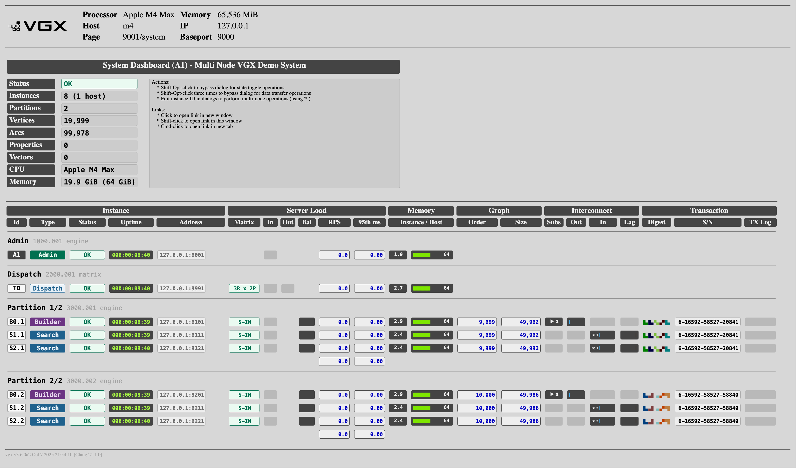

# 

Distributed engine for plugin-based graph and vector search

## Why VGX?

*VGX + 1 is WHY* ...and you are the +1. Originally short for **Vector Graph indeX**, VGX is a high-performance, distributed engine for building custom search and recommendation services using Python plugins. It combines real-time graph traversal, vector similarity, and expressive filtering into a unified platform, backed by a native C-core for speed and scalability. Developers can implement service logic using the **PyVGX** C-extensions, expose it as HTTP endpoints, and automatically scale across a sharded, replicated back-end. With built-in support for ANN search, dynamic graphs, expression-based filtering, and pluggable infrastructure, VGX makes it easy to develop powerful, low-latency systems for semantic search, recommendation, autocomplete, and more.

## Getting Started

You will need Python 3.12 or higher. It may be a good idea to use a virtual environment to keep things isolated:

**MacOS / Linux venv setup**
```bash
python3 -m venv vgxenv
source vgxenv/bin/activate
```

**Windows venv setup**
```bat
python3 -m venv vgxenv
call vgxenv\Scripts\activate.bat
```

**Install PyVGX**
```bash
pip install pyvgx
```

## Hello VGX

Now let's define and expose a service using VGX:

**Plugin Code**
```python
# hello.py
from pyvgx import *

system.Initialize("hello")

# This function will be exposed as an HTTP endpoint
def Hello(request: PluginRequest, message: str = "nothing"):
    response = PluginResponse()
    response.Append(f"Hi, you said {message}")
    return response

system.AddPlugin(Hello)

system.StartHTTP(9000) # main port=9000, admin port=9001
print("Visit 'http://127.0.0.1:9001' for admin" )

# Until SIGINT
system.RunServer()
```

**Start Service**
```bash
# Run the service
python hello.py
```

**Send Request**
```bash
# Send a request
curl http://127.0.0.1:9000/vgx/plugin/Hello?message=hello!
```

## VGX Demo System

If you want to see a more interesting demo system in action, type the following in a terminal:

```bash
# Start a multi-node VGX system
vgxdemosystem multi
```

This will start many server instances (using ~16GB RAM) and open a system dashboard in your web browser:

# 

Allow startup to finish and then try to send a query to the dispatcher running on port 9990:

```bash
# Run a test query, returns JSON search result
curl -s http://127.0.0.1:9990/vgx/plugin/search?name=7357 | jq
```

You can see how the demo is implemented here: [vgxdemoservice.py](pyvgx/src/py/vgxdemoservice.py) and [vgxdemoplugin.py](pyvgx/src/py/vgxdemoplugin.py) 


To stop the system type this in a terminal:

```bash
vgxdemoservice stop
```


